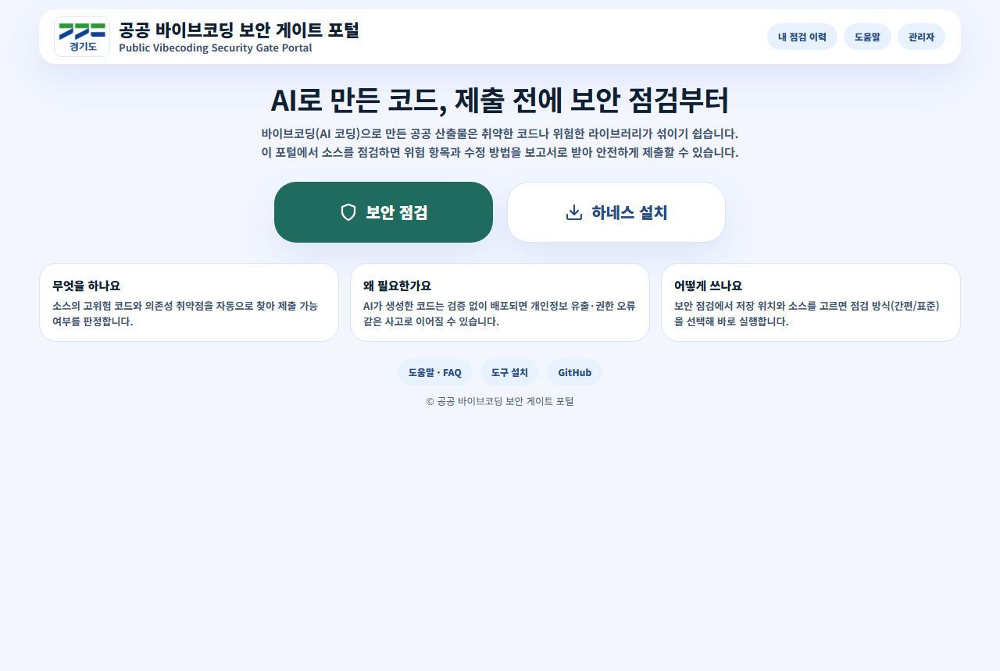
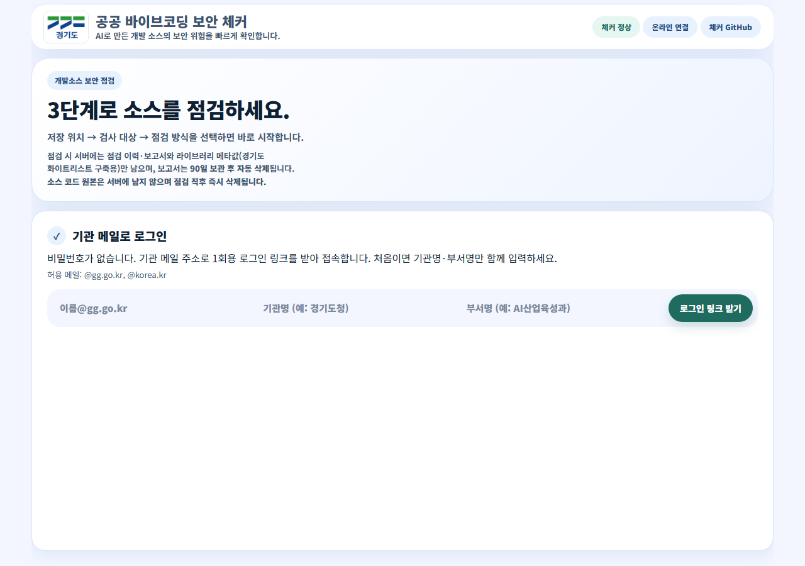

# 공공 바이브코딩 보안 게이트 포털

공무원이 AI로 만든 개발 소스를 **브라우저만으로** 보안 점검하고, 보고서를 받고, 기관의 패키지 화이트리스트 근거를 쌓도록 돕는 서버 기반 웹 서비스입니다.

사용자 PC에는 아무것도 설치하지 않습니다. 서버 한 대에 포털과 체커를 설치하면, 구성원 모두가 브라우저로 이용합니다.



## 왜 필요한가요

AI 코딩은 빠르지만, 만들어진 코드에 취약점이나 위험한 라이브러리가 섞여도 만든 사람이 알기 어렵습니다. 검증 없이 배포되면 개인정보 유출·권한 오류 같은 사고로 이어질 수 있고, 그렇다고 건건이 보안부서에 물어보면 개발도 검토도 느려집니다.

이 포털은 그 사이를 메웁니다.

- **개발하는 공무원**: 제출 전에 스스로 몇 분 만에 점검하고, 위험 항목과 수정 방법을 보고서로 받습니다.
- **검토하는 보안부서**: 점검 이력과 패키지 사용 근거가 정리된 상태에서 검토를 시작합니다.
- **기관 전체**: 점검이 쌓일수록 패키지 화이트리스트 근거가 축적되어, 갈수록 더 안전하고 편하게 개발할 수 있는 환경이 됩니다.

## 이용 흐름 (약 3분)

1. 기관 메일 주소로 1회용 로그인 링크를 받아 클릭합니다 — 비밀번호가 없습니다.
2. 보고서를 저장할 내 PC 폴더를 고르고, 검사 대상(폴더·ZIP·GitHub 주소)을 선택합니다.
3. 간편 점검(개발 중) 또는 표준 점검(제출 전)을 실행합니다.
4. 판정과 보고서를 확인하고, 필요하면 버튼 하나로 보안성검토를 요청합니다.



## 프로젝트 경계

| 구분 | 위치 | 역할 |
|---|---|---|
| 하네스 | [vibecode-harness](https://github.com/Lex6won/vibecode-harness) | 개발 PC에서 안전한 개발 순서를 잡아주는 표준 키트 (집행) |
| 보안 체커 | [vibecode-checker](https://github.com/Lex6won/vibecode-checker) (`gvskb`) | 소스·의존성 보안 점검 엔진 (관측) |
| 이 포털 | 현재 저장소 | 점검 실행·보고서 전달·이력·화이트리스트 근거 축적 (편의) |

승인·차단 판정은 어떤 도구도 하지 않습니다 — 판정은 보안부서(사람)의 몫이며, 포털은 그 근거를 전달·축적할 뿐입니다. 세 도구의 역할 합의는 `docs/27`에 있습니다.

## 주요 기능

**일반 사용자 (공무원)**

- 기관 메일(@gg.go.kr, @korea.kr)로 가입 — 비밀번호 없이 1회용 로그인 링크
- 폴더·ZIP 업로드 또는 GitHub 주소로 점검 — 간편(개발 중) / 표준(제출 전)
- 보고서(HTML·MD·JSON)를 내가 고른 PC 폴더에 저장
- 내 점검 이력 조회, 보안성검토 요청
- 서버는 소스 원본을 보관하지 않습니다 — 점검 직후 즉시 삭제되고, 보고서도 보존기한(기본 90일) 후 자동 삭제됩니다
- 점검 시 라이브러리 메타값(이름·버전·취약점 등)만 화이트리스트 구축용으로 자동 축적됩니다 — 소스 코드는 포함되지 않습니다

**관리자**

- 별도 관리자 계정으로 로그인 (`/admin`)
- 점검 현황(건수·판정 분포·큐·디스크), 점검 로그 조회
- 패키지 화이트리스트 근거: 관측된 패키지를 담기·제외하고 근거 목록으로 저장(다운로드) — 모든 변경은 감사 기록으로 남습니다
- 보안성검토 요청 대기열 확인

## 시작하기

**사용자**: 기관에서 안내한 포털 주소에 접속 → 기관 메일로 가입 → `보안 점검`에서 저장 위치·검사 대상·점검 방식만 고르면 됩니다. 자세한 사용법은 포털의 `도움말` 화면에 있습니다.

**서버 설치 담당자**: `docs/29_서버_구축_절차서.md` 를 따르세요. 요약:

```powershell
git clone https://github.com/Lex6won/vibecode-security-gate-portal
git clone https://github.com/Lex6won/vibecode-checker
cd vibecode-security-gate-portal
npm ci
copy config\server.env.example .env   # 값 설명은 파일 주석 참고
npm start
```

- 체커는 서버에 별도 설치합니다(`pip install -e .` 후 `gvskb doctor` 확인).
- 상시 가동(서비스 등록·방화벽·배포·롤백)은 절차서의 스크립트(`scripts/setup-server.ps1`, `scripts/deploy-server.ps1`)를 사용합니다.
- 현재 서버는 Windows 기준입니다.

## 관리자 계정

최초 실행 전 `.env`에 `ADMIN_ID`, `ADMIN_INITIAL_PASSWORD`(12자 이상)를 설정하세요. 인증 정보는 해시로 저장되며 Git에 포함되지 않습니다. 로그인 후 관리자 화면에서 비밀번호를 변경할 수 있고, 변경 시 기존 세션은 폐기됩니다.

## 폴더 구조

```text
vibecode-security-gate-portal/
├── src/                    # 포털 서버 (server.js + 계정·관측·화이트리스트·HWPX 저장층)
├── design/html-prototype/  # 실제 서비스 화면 (서버가 이 폴더를 서빙)
├── config/                 # 서버 설정 프로파일 예시 (server.env.example)
├── scripts/                # 서버 세팅·배포·릴리스 번들·테스트 스크립트
├── docs/                   # 설계·계약·절차서·개발 연혁
├── db/schema.postgresql.sql  # DB 전환 대비 스키마 (현재는 파일 기반 저장)
├── tool-manager/           # 도구 관리자(PC 프로그램) 이관 코드 — 실행체는 코드서명 확정 후
└── fixtures/               # 체커 검증용 취약 샘플 (실행 서비스 아님)
```

## 핵심 문서

| 문서 | 내용 |
|---|---|
| `docs/27_사업목표와_도구별_역할합의_2026-08-28.md` | 체커·하네스·포털의 목표와 역할 경계 (모든 작업의 공통 기준) |
| `docs/22_서버기반_재설계.md` | 범위·아키텍처 확정본 |
| `docs/23_서버_API_계약.md` | API 계약 (하단 추기가 실구현 확정본) |
| `docs/29_서버_구축_절차서.md` | 서버 설치·배포·이관 절차 (테스트 서버·기관 서버 공용) |
| `docs/12_harness_checker_implementation_log.md` | 개발 연혁 — 결정과 시행착오 기록 |

그 외 문서는 설계 과정의 기록이며, 위 문서와 다른 내용은 위 문서가 우선합니다.

## 개발 참여 시 검증

이 저장소는 커밋 전 강제 검증을 사용합니다. 새로 clone한 PC에서 1회 설정하세요.

```bash
git config core.hooksPath .githooks
npm run guard   # 문법·하네스 게이트·화면 계약·사용자 시나리오·HWPX·보안 점검
```

새 패키지를 설치하거나 버전을 바꾸기 전에는 체커 게이트로 먼저 확인합니다
(`node .\shared\enforcement\gvskb_gate.js check <package>`).

## 주의사항

`fixtures/` 아래 샘플은 일부러 취약하게 만든 테스트 입력입니다. 실행 서비스가 아니며, 운영망이나 실제 민원 데이터 환경에서 실행하지 마세요.
