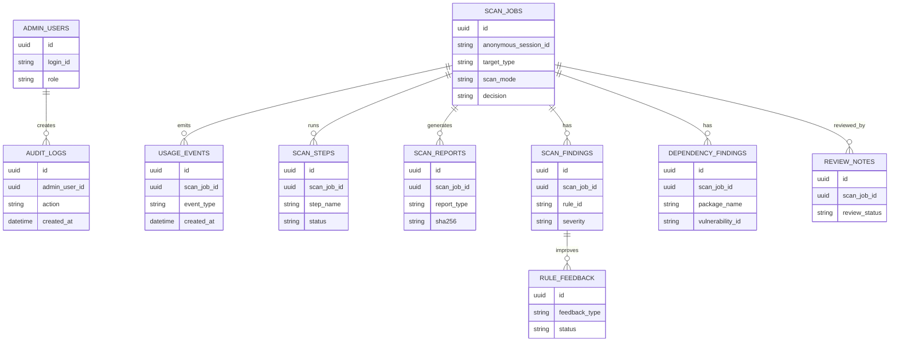

# 공공 바이브코딩 보안 체커 포털 DB 설계

> **2026-08-12 개정 고지**
> - 확장 스택이 **Supabase → 일반 PostgreSQL 16**으로 변경되었다(경기도 기관 제약: Supabase 금지·인증 직접구현 금지). 확정 스키마는 `db/schema.postgresql.sql`이며, `supabase/schema.sql`과 `docs/10_supabase_design.md`는 폐기 예정 참고자료다.
> - enum 확정값(문서 02/04/실제 코드와 통일):
>   - `scan_mode`: `quick / standard / full` (제출용 전체 점검 = full)
>   - 작업 판정 `scan_decision`: `allow / quick_complete / needs_review / blocked / incomplete` (server.js 실제 값 기준. 구 `submittable`→`allow`, `needs_fix`는 finding 레벨로 흡수)
>   - 발견 판정 `finding_decision`: 6상태 `confirmed_block / review_required / warning / false_positive_candidate / not_scanned / pass` (04 P0-2)
>   - `step_name`: `prepare_target / code_scan / dependency_scan / installed_packages_scan / vendor_bundle_scan / render_report / save_reports`
> - 관리자 인증: `admin_users`(자체 비밀번호) 방식은 정책 위반으로 폐기. 기관 통합인증(Keycloak OIDC/SSO/GPKI) subject를 저장하는 `admin_accounts`로 대체(착수 차단조건 B3).
> - 패키지 관측/판정 2계층(`package_observations` / `package_decisions`) 추가 — 웹사이트DB구상(2026-08-09) 및 gg-trusted-registry 연동합의 반영.
> 아래 본문은 개정 전 원문이며, 위 고지와 충돌하는 부분은 고지가 우선한다.

## 전제

- 일반 사용자는 로그인 없이 검사한다.
- 검사 화면에서 담당자명, 부서명, 개인정보를 입력받지 않는다.
- DB는 체커 개선, 사용량 산정, 결과 통계, 보고서 생성 여부 확인을 위해서만 사용한다.
- 총괄 관리자만 로그인해 익명 사용 현황과 점검 결과를 확인한다.
- 소스 원문, 압축파일 원본, GitHub 토큰, 개인 식별 정보는 저장하지 않는다.
- 담당자/부서 기반 제출 관리가 필요해지면 2차 기능으로 별도 로그인 또는 기관 인증을 설계한다.
- 1차 로컬 웹앱은 SQLite 또는 로컬 파일 DB로 시작할 수 있지만, 스키마는 Supabase PostgreSQL로 확장 가능한 구조로 맞춘다.
- Supabase 연계 상세와 RLS 초안은 `docs/10_supabase_design.md`, SQL 초안은 `supabase/schema.sql`에 둔다.

## ERD 요약

## 핵심 테이블

### admin_users

총괄 관리자 로그인 계정.

| 컬럼 | 타입 | 설명 |
| --- | --- | --- |
| id | uuid | 관리자 ID |
| login_id | varchar(80) unique | 로그인 아이디 |
| password_hash | varchar(255) | 비밀번호 해시 |
| display_name | varchar(80) | 관리자명 |
| role | varchar(30) | `super_admin` |
| is_active | boolean | 사용 여부 |
| last_login_at | datetime | 마지막 로그인 |
| created_at | datetime | 생성일 |

### scan_jobs

검사 1건의 기준 테이블. 개인이나 부서를 식별하지 않는다.

| 컬럼 | 타입 | 설명 |
| --- | --- | --- |
| id | uuid | 검사 ID |
| anonymous_session_id | varchar(80) | 브라우저/앱 세션 단위 익명 ID |
| project_name | varchar(160) nullable | 사용자가 입력하거나 추정된 프로젝트명 |
| target_type | varchar(20) | `folder`, `archive`, `github_url` |
| target_label | varchar(500) | 화면 표시용 대상명. 로컬 전체 경로는 저장하지 않는다 |
| target_fingerprint_hash | char(64) nullable | 대상 식별용 해시. 원문 경로/URL 저장 대체 |
| scan_mode | varchar(20) | `quick`, `standard` |
| checker_version | varchar(40) | 체커 버전 |
| ruleset_version | varchar(80) | 룰셋/인텔 버전 |
| network_mode | varchar(20) | `online`, `offline` |
| status | varchar(30) | `queued`, `running`, `completed`, `failed` |
| decision | varchar(30) | `submittable`, `needs_fix`, `needs_review`, `blocked` |
| sync_status | varchar(30) | `not_enabled`, `pending`, `synced`, `failed` |
| scanned_file_count | integer | 검사 파일 수 |
| ignored_file_count | integer | 제외 파일 수 |
| finding_count | integer | 전체 탐지 수 |
| dependency_finding_count | integer | 의존성 탐지 수 |
| false_positive_candidate_count | integer | 오탐 후보 수 |
| duration_ms | integer | 검사 소요 시간 |
| error_code | varchar(80) nullable | 실패 코드 |
| started_at | datetime | 시작 시각 |
| finished_at | datetime | 종료 시각 |
| created_at | datetime | 생성 시각 |

### scan_steps

검사 단계별 진행과 실패 사유.

| 컬럼 | 타입 | 설명 |
| --- | --- | --- |
| id | uuid | 단계 ID |
| scan_job_id | uuid fk | 검사 ID |
| step_name | varchar(60) | `prepare_target`, `code_scan`, `dependency_scan`, `render_report` |
| status | varchar(30) | `queued`, `running`, `completed`, `failed`, `cancelled` |
| message | text nullable | 화면 표시용 짧은 메시지 |
| started_at | datetime nullable | 시작 시각 |
| finished_at | datetime nullable | 종료 시각 |
| created_at | datetime | 생성 시각 |

### usage_events

사용량 산정과 UX 개선을 위한 익명 이벤트.

| 컬럼 | 타입 | 설명 |
| --- | --- | --- |
| id | uuid | 이벤트 ID |
| scan_job_id | uuid nullable fk | 관련 검사 ID |
| anonymous_session_id | varchar(80) | 익명 세션 ID |
| event_type | varchar(60) | `open_page`, `select_target`, `start_scan`, `download_report`, `scan_failed` 등 |
| scan_mode | varchar(20) nullable | 검사 방식 |
| target_type | varchar(20) nullable | 대상 유형 |
| client_type | varchar(30) | `web`, `desktop`, `mcp` |
| checker_version | varchar(40) nullable | 체커 버전 |
| created_at | datetime | 발생 시각 |

### scan_reports

검사 결과 파일 기록. 파일 원문은 DB에 저장하지 않는다.

| 컬럼 | 타입 | 설명 |
| --- | --- | --- |
| id | uuid | 보고서 ID |
| scan_job_id | uuid fk | 검사 ID |
| report_type | varchar(20) | `html`, `json`, `markdown`, `sarif` |
| file_name | varchar(255) | 파일명 |
| file_path_label | varchar(500) | 사용자 표시용 저장 위치 |
| storage_object_path | varchar(500) nullable | Supabase Storage 선택 업로드 경로 |
| sha256 | char(64) | 파일 무결성 해시 |
| file_size | bigint | 파일 크기 |
| created_at | datetime | 생성 시각 |

### scan_findings

코드/설정 탐지 항목.

| 컬럼 | 타입 | 설명 |
| --- | --- | --- |
| id | uuid | 탐지 ID |
| scan_job_id | uuid fk | 검사 ID |
| rule_id | varchar(120) | 룰 ID |
| rule_name | varchar(255) | 룰명 |
| severity | varchar(20) | `critical`, `high`, `medium`, `low`, `info` |
| decision | varchar(30) | `block`, `requires_review`, `warn`, `pass` |
| file_path_hash | char(64) nullable | 파일 경로 해시 |
| file_ext | varchar(20) nullable | 파일 확장자 |
| line_start | integer nullable | 시작 줄 |
| line_end | integer nullable | 종료 줄 |
| evidence_summary | text | 근거 요약 |
| safe_fix | text | 안전한 수정 방향 |
| confidence | varchar(20) | `high`, `medium`, `low` |
| is_false_positive_candidate | boolean | 오탐 후보 여부 |
| created_at | datetime | 생성 시각 |

### dependency_findings

의존성 취약점 탐지 항목.

| 컬럼 | 타입 | 설명 |
| --- | --- | --- |
| id | uuid | 의존성 탐지 ID |
| scan_job_id | uuid fk | 검사 ID |
| package_name | varchar(255) | 패키지명 |
| package_version | varchar(80) | 버전 |
| ecosystem | varchar(40) | `npm`, `pypi` 등 |
| vulnerability_id | varchar(80) | CVE/GHSA/OSV ID |
| severity | varchar(20) | 심각도 |
| reachable | varchar(30) | `reachable`, `not_reachable`, `unknown` |
| fixed_version | varchar(80) | 수정 버전 |
| dependency_path | text | 유입 경로 |
| created_at | datetime | 생성 시각 |

### rule_feedback

체커 개선을 위한 피드백 후보. 원본 탐지를 삭제하지 않고 개선 항목만 별도 기록한다.

| 컬럼 | 타입 | 설명 |
| --- | --- | --- |
| id | uuid | 피드백 ID |
| scan_job_id | uuid nullable fk | 검사 ID |
| finding_id | uuid nullable fk | 코드 탐지 ID |
| dependency_finding_id | uuid nullable fk | 의존성 탐지 ID |
| feedback_type | varchar(40) | `false_positive`, `over_detection`, `missed_detection`, `message_improvement`, `dependency_reachability` |
| status | varchar(30) | `needs_rule_change`, `confirmed`, `false_positive`, `accepted_risk`, `needs_fix` |
| rule_id | varchar(120) nullable | 룰 ID |
| note | text nullable | 검토 메모 |
| reviewer_id | uuid nullable fk | 관리자 ID |
| created_at | datetime | 생성 시각 |
| updated_at | datetime | 수정 시각 |

### review_notes

체커 개선을 위한 판정 보정 기록.

| 컬럼 | 타입 | 설명 |
| --- | --- | --- |
| id | uuid | 검토 ID |
| scan_job_id | uuid fk | 검사 ID |
| finding_id | uuid nullable | 탐지 ID |
| finding_type | varchar(30) | `code`, `dependency`, `scan` |
| reviewer_id | uuid nullable fk | 관리자 ID |
| review_status | varchar(30) | `confirmed`, `false_positive`, `accepted_risk`, `needs_fix` |
| note | text | 검토 메모 |
| created_at | datetime | 생성 시각 |

### daily_usage_stats

대시보드 성능을 위한 일별 집계 테이블.

| 컬럼 | 타입 | 설명 |
| --- | --- | --- |
| stat_date | date | 기준일 |
| client_type | varchar(30) | `web`, `desktop`, `mcp` |
| scan_mode | varchar(20) | 검사 방식 |
| target_type | varchar(20) | 대상 유형 |
| scan_count | integer | 검사 수 |
| completed_count | integer | 완료 수 |
| failed_count | integer | 실패 수 |
| needs_fix_count | integer | 수정 필요 수 |
| needs_review_count | integer | 사람 검토 수 |
| submittable_count | integer | 제출 가능 수 |

### audit_logs

총괄 관리자 행위 감사 로그.

| 컬럼 | 타입 | 설명 |
| --- | --- | --- |
| id | uuid | 로그 ID |
| admin_user_id | uuid nullable | 관리자 ID |
| action | varchar(80) | `login`, `download_report`, `update_review` 등 |
| target_type | varchar(40) | 대상 유형 |
| target_id | uuid nullable | 대상 ID |
| ip_address_hash | char(64) nullable | IP 해시 |
| user_agent | varchar(500) | 브라우저/클라이언트 |
| created_at | datetime | 생성 시각 |

## 필수 인덱스

- `scan_jobs(created_at)`
- `scan_jobs(decision, created_at)`
- `scan_jobs(target_type, created_at)`
- `scan_jobs(scan_mode, created_at)`
- `scan_jobs(anonymous_session_id, created_at)`
- `scan_steps(scan_job_id, created_at)`
- `usage_events(event_type, created_at)`
- `usage_events(client_type, created_at)`
- `scan_findings(scan_job_id, severity)`
- `scan_findings(rule_id, created_at)`
- `dependency_findings(scan_job_id, severity)`
- `scan_reports(scan_job_id, report_type)`
- `rule_feedback(rule_id, created_at)`
- `daily_usage_stats(stat_date, client_type, scan_mode)`
- `audit_logs(admin_user_id, created_at)`

## 화면-DB 매핑

- 보안검사 화면
  - 검사 대상: `scan_jobs.target_type`, `scan_jobs.target_label`, `scan_jobs.target_fingerprint_hash`
  - 검사 방식: `scan_jobs.scan_mode`
  - 결과 저장 위치: `scan_reports.file_path_label`
  - 사용 이벤트: `usage_events`

- 관리자 현황 화면
  - 검색: `target_label`, `project_name`
  - 결과 필터: `decision`
  - 기간 필터: `created_at`
  - 사용량 지표: `daily_usage_stats`
  - 상세 패널: `scan_jobs`, `scan_reports`, `scan_findings`, `dependency_findings`

## 보안/개인정보 원칙

- 담당자명과 부서명은 1차 서비스에서 수집하지 않는다.
- 로컬 전체 경로, 소스 코드 원문, 압축파일 원본, GitHub 토큰은 저장하지 않는다.
- 대상 식별이 필요하면 원문 대신 해시 또는 짧은 표시명만 저장한다.
- 보고서 다운로드와 검토 상태 변경은 `audit_logs`에 남긴다.
- 보고서 파일은 저장 위치 표시명과 SHA-256 해시를 함께 기록해 결과물 변조 여부를 확인한다.
- 오탐/과탐 보정은 원본 탐지 결과를 삭제하지 않고 `review_notes`로 별도 기록한다.
- 체커 룰 개선 후보는 `rule_feedback`에 남기고, 실제 룰 변경은 별도 적대적 검증과 릴리스 승인을 거친다.

## Supabase 연계 원칙

- Supabase에는 중앙 관리자 화면과 익명 통계를 위한 메타데이터만 저장한다.
- 브라우저에서 `scan_jobs`, `scan_findings`, `dependency_findings`에 직접 쓰지 않는다.
- 로컬 웹앱은 중앙 포털 API 또는 Supabase Edge Function으로 메타데이터를 전송한다.
- Edge Function은 service role로 저장하되, service role key는 로컬 앱과 브라우저에 포함하지 않는다.
- 총괄 관리자는 Supabase Auth로 로그인하고 RLS로 조회 권한을 제한한다.
- 보고서 파일 업로드는 기본 꺼짐이며, 사용자가 선택한 경우에만 private Storage bucket에 저장한다.
